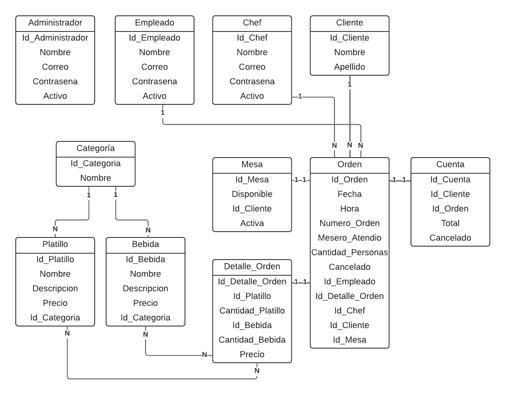

# Sitio Web para un Restaurante

Proyecto final del curso Programación Avanzada en Web del II Cuatrimestre del 2024, Universidad Fidélitas. 

Profesor: Jose Andrés Arias Brenes.

## Integrantes

Mateo Esquivel Rodríguez, Cristofer Andrés Marín Lazo, Ariana Jenkins Carrillo y Jerry Fabricio Campos Arias.

## Descripción

Sitio web de un restaurante para gestionar los empleados, los chefs, también el menú, las órdenes, las mesas disponibles y las cuentas de los clientes. La idea es que cada usuario utilice el sistema en su estación de producción y tengan acceso a la información que necesitan para operar en el restaurante.

## Roles

| Administrador        | Empleado                        | Chef                      | Cliente   
|--------------        |--------------                   |--------------             |----------
| CRUD Administrador   | CRUD Órdenes                    | Ver menú                  | Crear una cuenta a partir de la orden 
| CRUD Empleados       | Ver mesas disponibles           | Ver y finalizar órdenes     
| CRUD Chefs           | Asignar clientes a una mesa     | Login y Registro          
| CRUD Mesas           | Login y Registro                   
| CRUD Menú     
| Ver Cuentas     
| Login y Registro          

## Módulos

| Autenticación    | Menú             | Órdenes      | Mesas        | Cuentas      | Usuarios
|--------------    |--------------    |--------------|--------------|--------------|--------------
| Administrador    | Administrador    |              | Administrador|Administrador |Administrador
| Empleado         |  Empleado        |  Empleado    | Empleado     |              |   
| Chef             |  Chef            |  Chef        |              |              |  

## Diagrama Entidad-Relación

## Características
- Desarrollado en ASP.NET Core v7
- Escrito en C#
- Uso de API's para el consumo de datos
- SQL Server como base de datos
